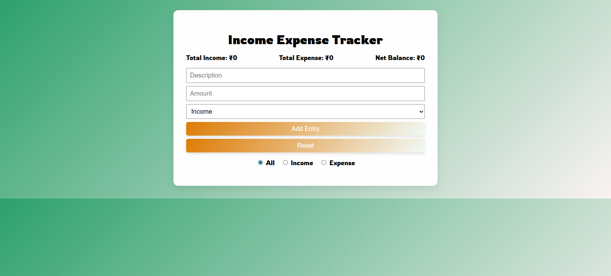

# 💰 Income Expense Calculator

A simple, responsive web app to **track income and expenses** with full **CRUD operations**, **filtering**, and **localStorage persistence**.

## 🚀 Features

- ➕ Add new income or expense entries
- 📝 Edit or ❌ delete existing entries
- 🔍 Filter entries by type: **All**, **Income**, or **Expense**
- 📊 See **Total Income**, **Total Expense**, and **Net Balance**
- 💾 Data is saved in **localStorage**, so it persists after refresh
- 📱 **Responsive design** for both desktop and mobile devices

## 🛠️ Tech Stack

- **HTML** – for structure  
- **CSS** – for styling and layout  
- **JavaScript** – for logic, data handling, and DOM interaction

## 🧪 How to Run

1. **Clone** or **download** this repository  
2. Open `index.html` in any modern web browser (Chrome, Firefox, Edge, etc.)

## 🖼️ Screenshot

